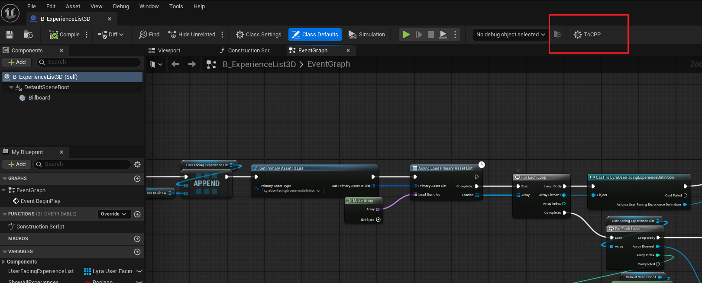

# BPConverter
An attempt to bring Blueprint Nativization back to UE5

## Purpose
+ For educational purposes only
+ To make working with complex Blueprints slightly more manageable

## Important Notes
+ This is an auxiliary tool only - don't expect the converted code to compile directly

## Development Environment
+ Windows 11
+ UE5.5.4

## Usage
+ Convert Blueprints into machine-generated code
+ Use ChatGPT or DeepSeek to refine the output

## Known Issues
+ ~~UDynamicClass has been removed~~
+ Some newer properties are unsupported
+ Additional issues may exist

## Screenshots
1. **Tool Entry Point**  
     
   Shows where to find BPConverter in the UE editor interface

2. **Main Tool Interface**  
     
   The primary conversion interface of BPConverter

3. **Blueprint Example**  
     
   Example of a complex Blueprint ready for conversion

4. **AI Translation Prompt**  
     
   Example prompt for refining code with DeepSeek

5-8. **Conversion Output Examples**  
     
     
     
     
   Sample outputs after DeepSeek processing, showing header and multiple cpp file sections